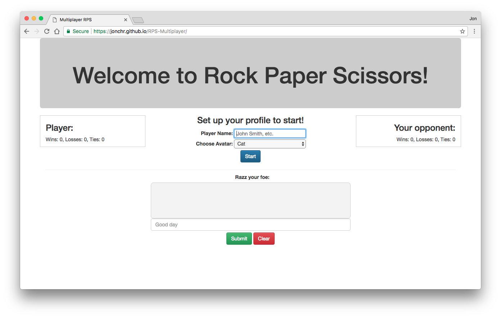
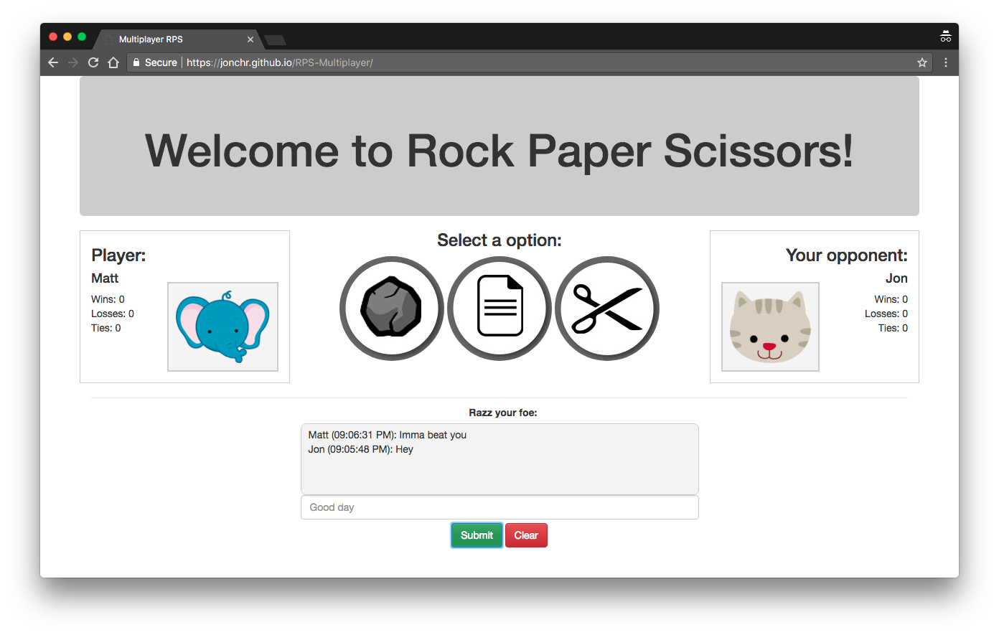
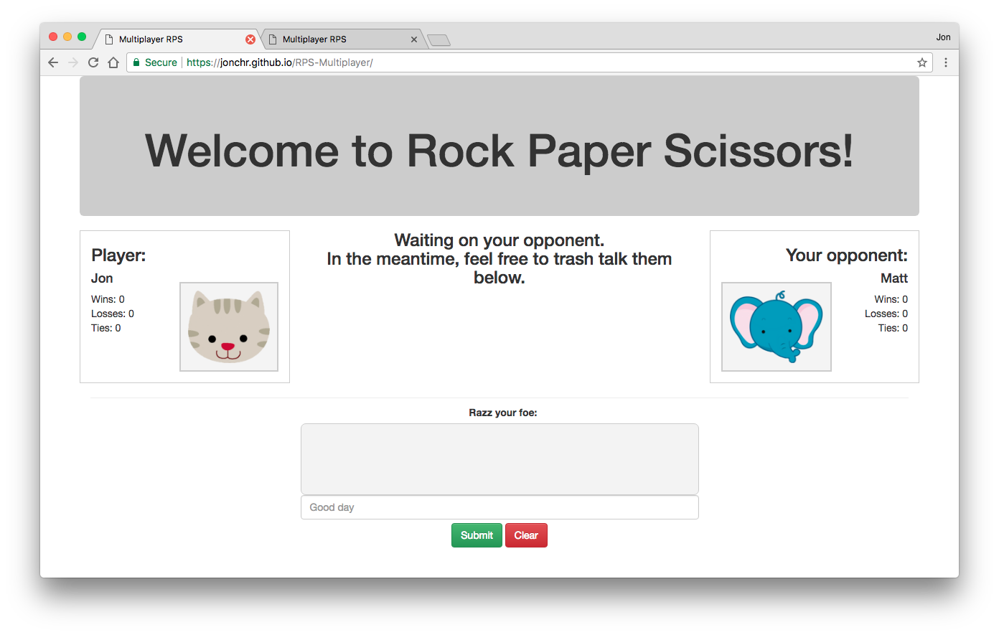
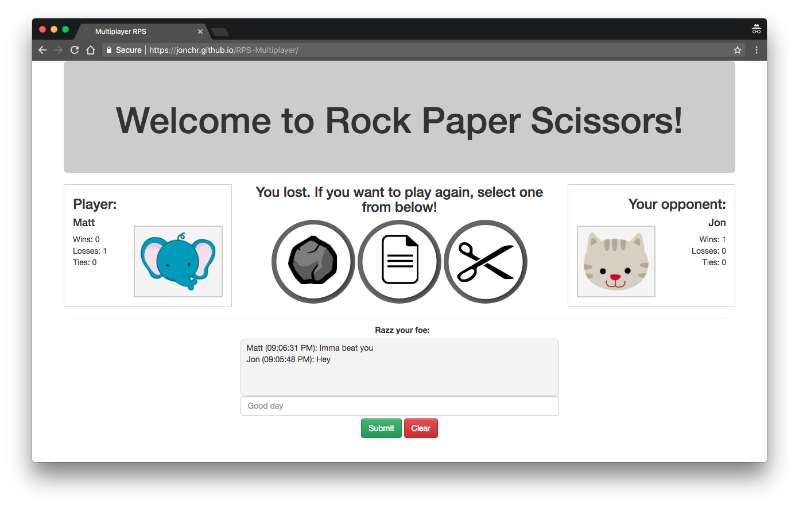
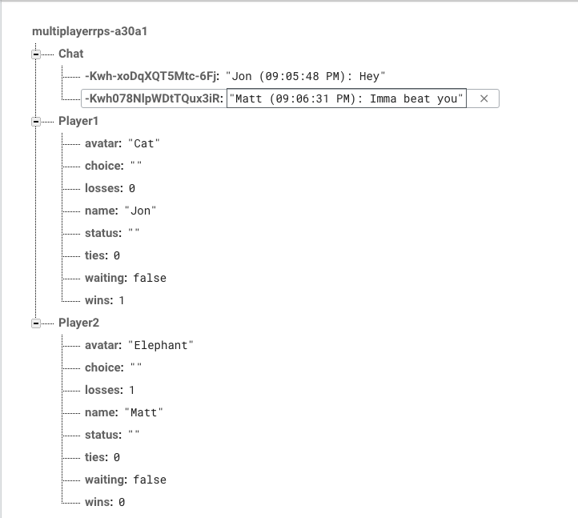

# RPS-Multiplayer
This app is a two player Rock-Paper-Scissors game that uses Firebase to store player information. A live version can be viewed at https://jonchr.github.io/RPS-Multiplayer

## Description

This app allows two remote players to compete in Rock-Paper-Scissors. Upon page load, players must enter their name and choose their animal avatar. They can then select their move choice, but will then have to wait for a second player to join and select their move.

Unlike other versions of this game, either player can select their move first as opposed to a set order. This is accomplished by having checking if the other player has selected their move and having the later player's page update the scores and status in Firebase.

In addition to main game functionality, there is also a chat box that allows players to communicate with each other. Each message will be posted with the author's name and timestamp. Any one with access to the page can also clear the chat.

Only two players are able to play at a time. Upon closing their page, a player's profile is deleted, allowing a new player to join in. When both player slots are occupied, any new visitors will receive a message telling them to wait for a spot to open up. They can, however, still access the chat box.

It is possible to test the app and play against one self by opening the page in two windows or tabs.

### Development

This site was developed as part of the GW Coding Bootcamp and was completed during the fourth week. It was built using HTML5, CSS3 with Bootstrap v3.3.7, Javascript, and jQuery. It also featured Firebase. For more information on Firebase see https://firebase.google.com/

The Rock, Paper, Scissors, and Animal Avatar pictures were all found using Google Image search.

### Organization

To run the game locally on your own computer, you can run the following in command line:

		git clone https://github.com/jonchr/RPS-Multiplayer.git
		cd RPS-Multiplayer
		open index.html

The HTML and CSS code is contained within index.html, while the Javascript and jQuery code is contained within the update.js file.

## Screenshots
### Main Page with Player sign-up prompt

### Both Players ready to play

### Waiting for the other player's move

### You lost - extra embarrassing after your trash talk

### A screenshot of the Firebase database

